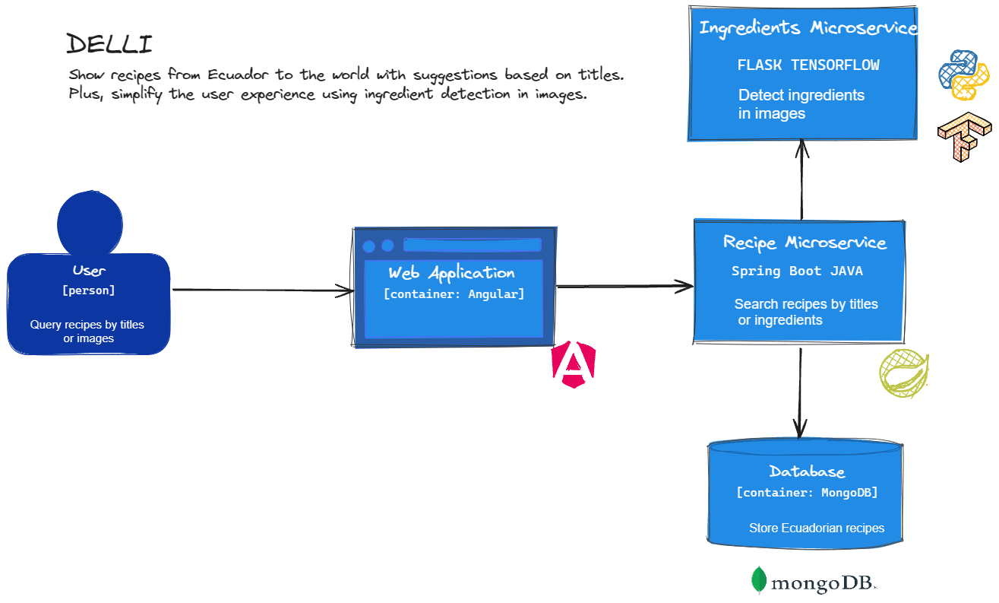

# DELLI
#### Video Demo:  [<URL HERE>](https://youtu.be/EG6E3MIY4eg?si=D6yF7uqwJCDzoUKx)https://youtu.be/EG6E3MIY4eg?si=D6yF7uqwJCDzoUKx
#### Description:
#### Architecture
---


#### Recipe Microservice
---
El microservicio tiene la responsabilidad de realizar consultas de recetas según los ingredientes y el título correspondiente. Fue implementado utilizando el lenguaje de programación `JAVA` y el framework `Spring Boot`. Para la gestión de la persistencia de datos, se emplea una base de datos documental `MongoDB`.

It features a three-tier architecture. In the first layer, called REST controller, the endpoints through which consumers can make their requests are defined. Next, in the services layer, is the business logic. Finally, the data layer is responsible for communication with the database

***Controller***
``` java
@RestController
@RequestMapping("/recipes")
public class RecipeController {

    @GetMapping("/searchByTitle")
    public Page<RecipeDto> filterByTitle(@RequestParam("title") String title, @PageableDefault Pageable pageable);
    @PostMapping("/searchByImage")
    public Page<RecipeDetailDto> getRecipeByImage(@RequestParam("file") MultipartFile multipartFile, @PageableDefault Pageable pageable);

}
```
***Repository***
``` java
@Service
public class RecipeService {
  public Page<RecipeDto> getRecipesByTitle(String title, Pageable pageable);
  public Page<RecipeDetailDto> getRecipeByImage(MultipartFile multipartFile, Pageable pageable);
}
```
***Repository***
``` java
@Repository
public interface RecipeRepository extends MongoRepository<Recipe, String> {
    Page<Recipe> findByTitleContainingIgnoreCase(String title, Pageable pageable);
    @Aggregation(pipeline = {
            "{$match: {'ingredients': {$in:  ?0}}}",
            "{$addFields: {'matchingIngredients': {$size: {$setIntersection: ['$ingredients',?0]}}} }",
            "{$sort: {'matchingIngredients':-1}}",
    })
    List<Recipe> findByIngredients(List<String> ingredients, Pageable pageable);
}
```


If the user wants to perform a query by `title`, they must perform a search in the database, thus obtaining the documents that match the specified title. On the other hand, if the query is based on ingredients detected in images, the process is more complex. Initially, the image must be sent to the **ingredients microservice**, which will be responsible for detecting the ingredients present in the image. Subsequently, once the ingredients have been identified, the database is consulted in search of recipes that contain any of the detected ingredients. The resulting list is sorted by the number of ingredients detected in each recipe, thus providing a result sorted by the number of matches.

> [!NOTE]
> Use pagination to return results more efficiently.

#### Ingredient Microservice
---
The microservice has the function of identifying ingredients in an image. It was developed using the `Python` programming language and `Flask` libraries to expose `REST` endpoints, as well as `Tensor Flow` to run object detection models.

The `YOLO V8` model was used for ingredient detection, which was previously trained to recognize the following classes of ingredients.
1. egg
2. cheese
3. milk
4. lemon 
5. onion
6. garlic
7. potatoe
8. green banana
9. tomato
10. chicken


Basically the model is loaded and the image is sent to it to detect the ingredients.
```python
detect_fn = tf.saved_model.load(PATH_TO_SAVED_MODEL)

@app.route('/predictIngredients', methods=['POST'])
def predictIngredientes():
    ingredients = {}
    for file in request.files:
        uploaded_file = request.files[file]
        ingredients_detected = detectIngredients(uploaded_file)
        ingredients.update(ingredients_detected)
    response = {
        "names": list(ingredients.keys())
    }
    return jsonify(response)

```

#### Web Aplication
---
The web application has been developed using the `TypeScript` programming language and the `Angular` framework, which makes it possible to create a single page application **(SPA)**. In addition, `PrimeNG` components have been used.

The application communicates with the microservices through HTTP requests, using Angular's HTTPClient, which returns observables. For these operations to be executed, it is necessary to subscribe to the observables, as exemplified below.

```typescript
  getRecipeDetail(id: string) {
    return this.http.get<Recipe>(`${this.URL}/${id}`)
  }

  this.recipeService.getRecipeDetail(this.recipeId)
      .subscribe({
        next: (r) => {
          this.recipe = r;
          console.log(this.recipe)
        },
        error: (err) => {
          console.error(err)
          this.loadRecipe = false
        },
        complete: () => {
          this.loadRecipe = false
        }
      })

```

> [!IMPORTANT]
> The entire web application is structured based on components, each of which has its respective HTML, CSS and TypeScript code files.
